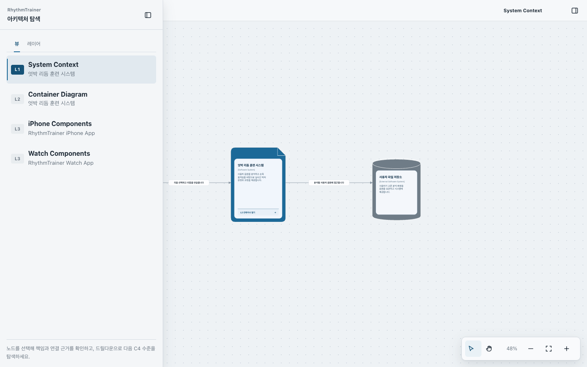
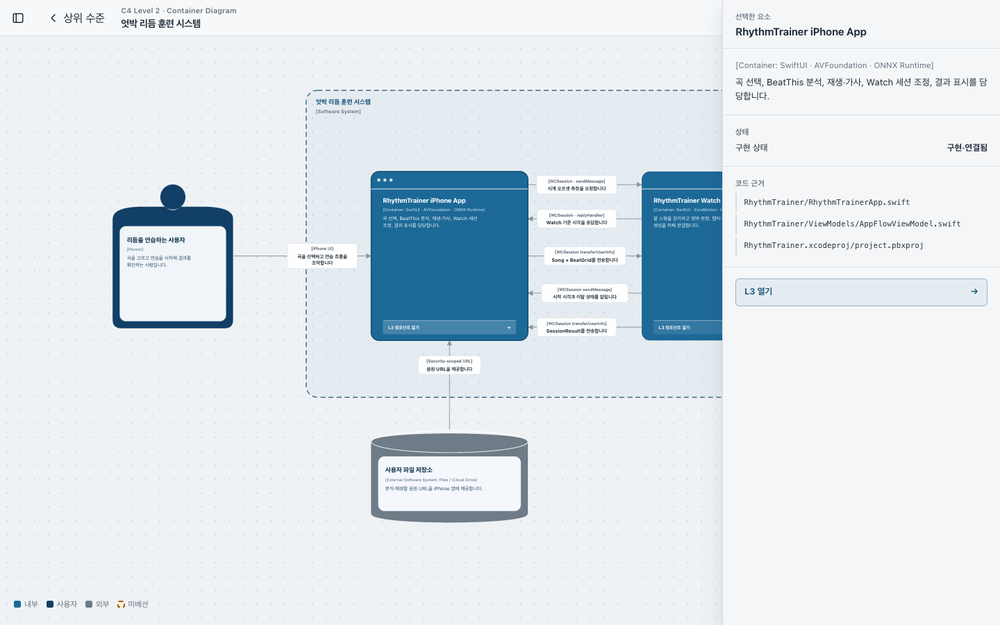
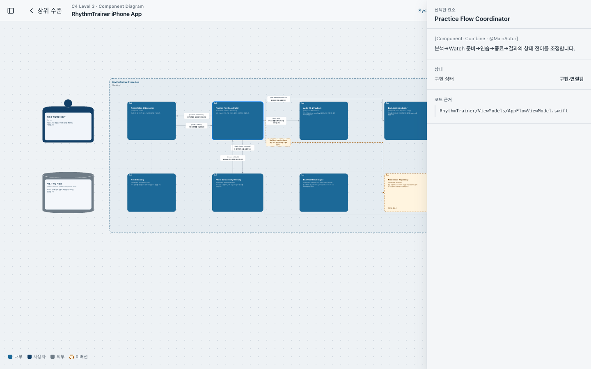
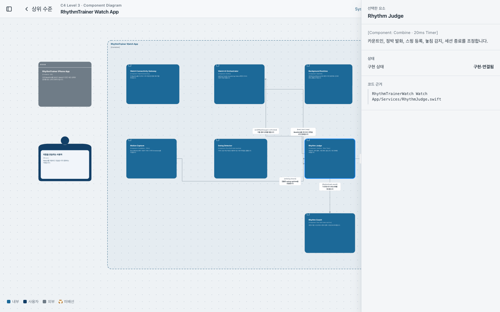

# RhythmTrainer C4 Architecture Explorer

RhythmTrainer의 iPhone·Apple Watch 아키텍처를 큰 맥락에서 컴포넌트 책임까지 단계적으로 탐색하는 C4 다이어그램입니다.

[Live Demo](https://rhythmtrainer-c4-explorer.thyang78940.chatgpt.site) · [Standalone HTML](./rhythmtrainer-c4-explorer.html) · [Tests](./tests/rhythmtrainer-c4-explorer.test.mjs)



## 프로젝트 소개

한 화면에 모든 구현 요소를 펼쳐 놓는 대신, C4 모델의 추상화 수준에 맞춰 필요한 정보만 점진적으로 공개합니다.

- **L1 — System Context:** 사용자, RhythmTrainer 시스템, 외부 파일 저장소의 관계를 보여줍니다.
- **L2 — Container Diagram:** iPhone 앱과 Watch 앱의 책임, 통신 경로, 사용 기술을 보여줍니다.
- **L3 — Component Diagram:** 각 앱 내부 컴포넌트의 역할과 실제 코드 근거를 보여줍니다.
- **L4 — Code:** 이 탐색기의 범위에서 의도적으로 제외했습니다.

## C4 탐색 흐름

| 수준 | 답하는 질문 | 표현 범위 |
| --- | --- | --- |
| L1 System Context | 누가 시스템을 사용하고, 어떤 외부 시스템과 연결되는가? | Person, Software System, External Software System |
| L2 Container | 시스템을 구성하는 실행·배포 단위는 무엇인가? | iPhone App, Watch App, Files / iCloud Drive |
| L3 Component | 컨테이너 내부 책임은 어떤 컴포넌트로 나뉘는가? | UI, 흐름 조정, 분석, 재생, 연결, 판정, 코칭 |

각 드릴다운 가능한 컨테이너에는 **L2/L3 열기** 푸터가 같은 위치에 표시됩니다. 노드를 선택하면 직접 연결된 관계만 선명해지고, Inspector에서 책임·구현 상태·코드 근거를 확인할 수 있습니다.

## 실제 화면

모든 화면은 [배포본](https://rhythmtrainer-c4-explorer.thyang78940.chatgpt.site)에서 1440×900 데스크톱 뷰포트로 캡처했습니다. 상단의 L1 화면은 사용자와 시스템, 외부 파일 저장소만 남겨 제품의 경계를 먼저 보여줍니다.

### L2 — Container Diagram

iPhone·Watch 컨테이너와 파일 저장소의 연결을 보여줍니다. 아래 화면은 iPhone App을 선택해 직접 관계와 Inspector를 강조한 상태입니다.



### L3 — iPhone Components

화면, 연습 흐름, 오디오, Beat 분석, Watch 연결, 결과 계산과 저장 책임을 분리해 보여줍니다.



### L3 — Watch Components

Watch 연결, UI 오케스트레이션, 백그라운드 실행, 동작 수집, 스윙 검출, 박자 판정과 코칭 흐름을 보여줍니다.



## 주요 기능

- **Diagram-first workspace:** 문서보다 캔버스를 중심에 둔 데스크톱 탐색 UI
- **Progressive disclosure:** 기본 상태에서는 관계를 은은하게 표시하고, 선택한 요소의 직접 관계와 라벨만 강조
- **Inline relationship labels:** 화살표 위에 기술을 먼저, 그 아래에 동작 설명을 표시
- **Semantic notation:** Person, 문서형 Software System, 원통형 Data Store를 형태만으로 구분
- **Explicit drill-down:** 컨테이너 하단의 일관된 푸터로 다음 C4 수준 이동
- **Inspector:** 선택 요소의 책임, 기술, 구현 상태와 코드 근거 제공
- **Canvas controls:** 선택, Hand, 패닝, 줌, 화면 맞춤 지원
- **Keyboard behavior:** `Space`를 누르는 동안 Hand 도구로 전환하고, `Escape`로 선택 해제
- **Independent panels:** 왼쪽 탐색 패널과 오른쪽 Inspector를 열고 닫아 캔버스 공간 확보
- **Offline artifact:** 외부 라이브러리나 네트워크 요청 없이 단일 HTML로 실행

## 표기 원칙

- 관계는 단방향 화살표로 표현합니다.
- 관계 라벨은 `[기술 또는 프로토콜]`과 구체적인 동작 설명으로 구성합니다.
- 내부 요소는 파란색, 사용자는 짙은 남색, 외부 시스템은 회색, 미배선 요소는 주황색으로 구분합니다.
- Software System과 Container 경계는 점선 Boundary로 표시합니다.
- 현재 수준에서 필요한 정보만 표시하고, 세부 구현은 다음 수준에서 공개합니다.
- L3 컴포넌트에서 더 깊은 L4 드릴다운은 제공하지 않습니다.

## 실행 방법

### 배포본

[RhythmTrainer C4 Architecture Explorer 열기](https://rhythmtrainer-c4-explorer.thyang78940.chatgpt.site)

### 로컬

별도 빌드나 서버가 필요하지 않습니다.

```bash
open rhythmtrainer-c4-explorer.html
```

다른 운영체제에서는 파일을 브라우저로 직접 열면 됩니다.

## 테스트

Node.js 내장 테스트 러너만 사용합니다.

```bash
node --test tests/rhythmtrainer-c4-explorer.test.mjs
```

테스트는 다음 계약을 검증합니다.

- C4 L1/L2/L3 모델과 드릴다운 구조
- 모든 관계의 방향, 라벨, 기술 정보와 연결 대상
- 노드·Boundary·관계 라우팅 및 라벨 충돌 방지
- 점진적 관계 공개와 선택 상태
- 패닝·줌·Space Hand 및 패널 포커스 보존
- 키보드 탐색, 접근 가능한 이름과 WCAG AA 대비
- 외부 요청 없는 standalone 실행

## 프로젝트 구조

```text
.
├── rhythmtrainer-c4-explorer.html
├── assets/
│   └── c4-node-shape-style-reference.png
├── creating-c4-diagrams/
│   └── assets/c4-explorer-shell.html
├── docs/images/
│   ├── c4-l1-system-context.png
│   ├── c4-l2-container-selected.png
│   ├── c4-l3-iphone-components.png
│   └── c4-l3-watch-components.png
└── tests/
    └── rhythmtrainer-c4-explorer.test.mjs
```

## 현재 범위

- 아키텍처를 읽고 탐색하는 **read-only 도구**입니다.
- 다이어그램의 코드 근거는 분석 시점의 RhythmTrainer 경로를 표시합니다.
- 화면 안에서 모델을 편집하거나 저장하는 기능은 포함하지 않습니다.
- C4 Level 4 코드 다이어그램은 포함하지 않습니다.

## 참고

- [The C4 model for visualising software architecture](https://c4model.com/)
- [Structurizr documentation](https://docs.structurizr.com/)
